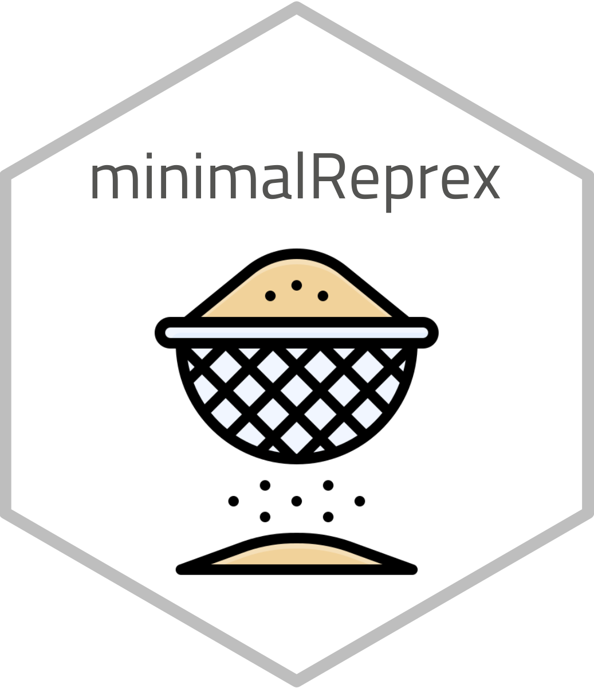

```{r, include = FALSE}
knitr::opts_chunk$set(
  collapse = TRUE,
  comment = "#>",
  fig.path = "man/figures/README-",
  out.width = "100%"
)
```

# Minimal reprexes for `{pkgdown}` issues 

Old resolved issue (and therefore corresponding reprexes have been removed)

- 1150
- 1282
- 1400

## Diagrams in Markdown files with Mermaid


## Acknowledgments

Hex sticker font is [Cairo](https://fonts.google.com/specimen/Cairo), and the image is adapted from icon made by [Freepik](https://www.freepik.com) from
[flaticon.com](https://www.flaticon.com/premium-icon/sieve_4670917).
