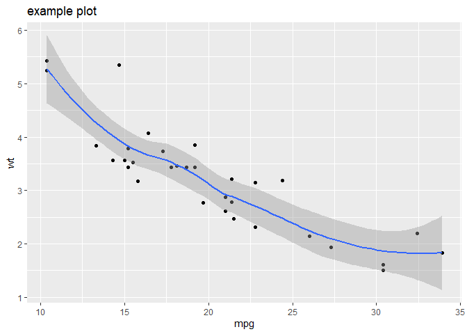

Minimal reprexes for `pkgdown` issue

<!--

# issue 1150

Link: https://github.com/r-lib/pkgdown/issues/1150

Problems with rendering `LaTeX` equations on `README` of `pkgdown` websites.

**This is observed only in Chrome, Internet Explorer, and Edge browsers**. 
No issue with Firefox browser.

This math text $\eta^2$ is inline, but this text moves to the next line in website.

This doesn't get rendered properly either:

option-1 | option-2
-------|-------
$\eta^2$ | $\omega^2$
x | y
1 | 2

-->

# issue 1282

Link: <https://github.com/r-lib/pkgdown/issues/1282>

(Observed at least in `Chrome`. **N.B. Not using netlifly, but rather
github pages**)

``` r
library(ggplot2)

# save the plot in an object
p <- ggplot(mtcars, aes(mpg, wt)) +
  geom_point() + 
  geom_smooth()

# modify
p + labs(title = "example plot")
#> `geom_smooth()` using method = 'loess' and formula 'y ~ x'
```



Session info

``` r
sessioninfo::session_info(include_base = TRUE)
#> - Session info ---------------------------------------------------------------
#>  setting  value                                             
#>  version  R Under development (unstable) (2020-02-28 r77874)
#>  os       Windows 10 x64                                    
#>  system   x86_64, mingw32                                   
#>  ui       RTerm                                             
#>  language (EN)                                              
#>  collate  English_United States.1252                        
#>  ctype    English_United States.1252                        
#>  tz       Europe/Berlin                                     
#>  date     2020-04-02                                        
#> 
#> - Packages -------------------------------------------------------------------
#>  ! package     * version    date       lib source                          
#>    assertthat    0.2.1      2019-03-21 [1] CRAN (R 4.0.0)                  
#>    base        * 4.0.0      2020-02-29 [?] local                           
#>    cli           2.0.2      2020-02-28 [1] CRAN (R 4.0.0)                  
#>    colorspace    1.4-1      2019-03-18 [1] CRAN (R 4.0.0)                  
#>  P compiler      4.0.0      2020-02-29 [2] local                           
#>    crayon        1.3.4      2017-09-16 [1] CRAN (R 4.0.0)                  
#>  P datasets    * 4.0.0      2020-02-29 [2] local                           
#>    digest        0.6.25     2020-02-23 [1] CRAN (R 4.0.0)                  
#>    dplyr         0.8.5      2020-03-07 [1] CRAN (R 4.0.0)                  
#>    ellipsis      0.3.0      2019-09-20 [1] CRAN (R 4.0.0)                  
#>    evaluate      0.14       2019-05-28 [1] CRAN (R 4.0.0)                  
#>    fansi         0.4.1      2020-01-08 [1] CRAN (R 4.0.0)                  
#>    farver        2.0.3      2020-01-16 [1] CRAN (R 4.0.0)                  
#>    ggplot2     * 3.3.0      2020-03-05 [1] CRAN (R 4.0.0)                  
#>    glue          1.3.2      2020-03-12 [1] CRAN (R 4.0.0)                  
#>  P graphics    * 4.0.0      2020-02-29 [2] local                           
#>  P grDevices   * 4.0.0      2020-02-29 [2] local                           
#>  P grid          4.0.0      2020-02-29 [2] local                           
#>    gtable        0.3.0      2019-03-25 [1] CRAN (R 4.0.0)                  
#>    htmltools     0.4.0      2019-10-04 [1] CRAN (R 4.0.0)                  
#>    knitr         1.28       2020-02-06 [1] CRAN (R 4.0.0)                  
#>    labeling      0.3        2014-08-23 [1] CRAN (R 4.0.0)                  
#>    lattice       0.20-40    2020-02-19 [2] CRAN (R 4.0.0)                  
#>    lifecycle     0.2.0.9000 2020-03-16 [1] Github (r-lib/lifecycle@355dcba)
#>    magrittr      1.5        2014-11-22 [1] CRAN (R 4.0.0)                  
#>    Matrix        1.2-18     2019-11-27 [2] CRAN (R 4.0.0)                  
#>  P methods     * 4.0.0      2020-02-29 [2] local                           
#>    mgcv          1.8-31     2019-11-09 [2] CRAN (R 4.0.0)                  
#>    munsell       0.5.0      2018-06-12 [1] CRAN (R 4.0.0)                  
#>    nlme          3.1-144    2020-02-06 [2] CRAN (R 4.0.0)                  
#>    pillar        1.4.3      2019-12-20 [1] CRAN (R 4.0.0)                  
#>    pkgconfig     2.0.3      2019-09-22 [1] CRAN (R 4.0.0)                  
#>    purrr         0.3.3      2019-10-18 [1] CRAN (R 4.0.0)                  
#>    R6            2.4.1      2019-11-12 [1] CRAN (R 4.0.0)                  
#>    Rcpp          1.0.4      2020-03-17 [1] CRAN (R 4.0.0)                  
#>    rlang         0.4.5      2020-03-01 [1] CRAN (R 4.0.0)                  
#>    rmarkdown     2.1        2020-01-20 [1] CRAN (R 4.0.0)                  
#>    scales        1.1.0      2019-11-18 [1] CRAN (R 4.0.0)                  
#>    sessioninfo   1.1.1      2018-11-05 [1] CRAN (R 4.0.0)                  
#>  P splines       4.0.0      2020-02-29 [2] local                           
#>  P stats       * 4.0.0      2020-02-29 [2] local                           
#>    stringi       1.4.6      2020-02-17 [1] CRAN (R 4.0.0)                  
#>    stringr       1.4.0      2019-02-10 [1] CRAN (R 4.0.0)                  
#>    tibble        3.0.0      2020-03-30 [1] CRAN (R 4.0.0)                  
#>    tidyselect    1.0.0      2020-01-27 [1] CRAN (R 4.0.0)                  
#>  P tools         4.0.0      2020-02-29 [2] local                           
#>  P utils       * 4.0.0      2020-02-29 [2] local                           
#>    vctrs         0.2.4      2020-03-10 [1] CRAN (R 4.0.0)                  
#>    withr         2.1.2      2018-03-15 [1] CRAN (R 4.0.0)                  
#>    xfun          0.12       2020-01-13 [1] CRAN (R 4.0.0)                  
#>    yaml          2.2.1      2020-02-01 [1] CRAN (R 4.0.0)                  
#> 
#> [1] C:/Users/inp099/Documents/R/win-library/4.0
#> [2] C:/Program Files/R/R-devel/library
#> 
#>  P -- Loaded and on-disk path mismatch.
```

Pandoc info

``` r
rmarkdown::pandoc_version()
#> [1] '2.9.2.1'
```
